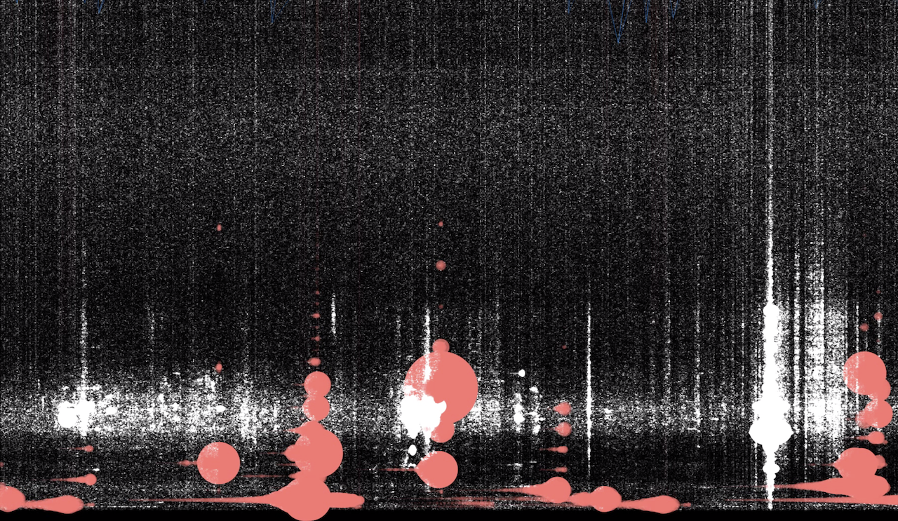
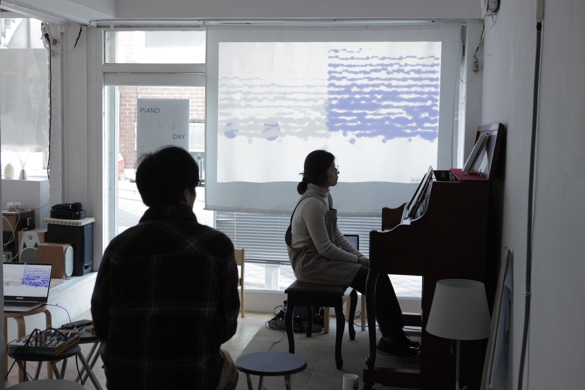
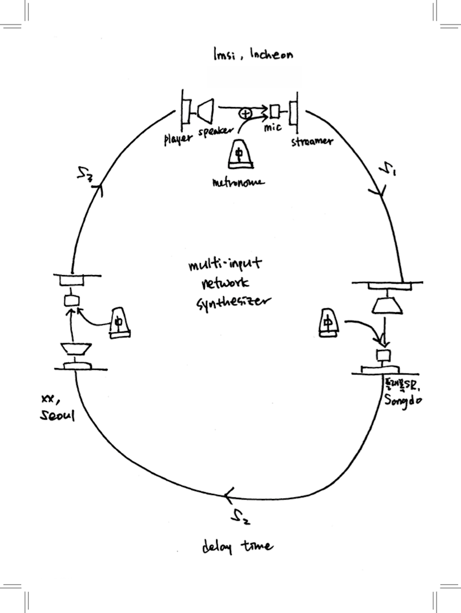
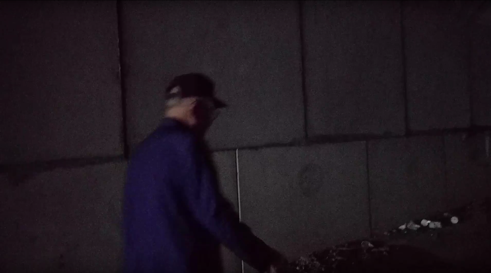
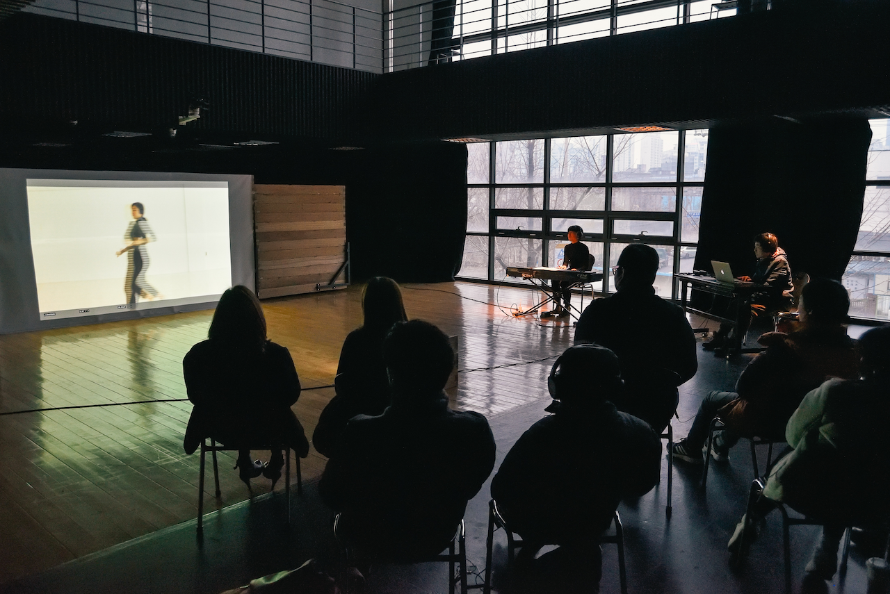

# WeatherReport

[NEWS](post/news.md) 
[WORKS](post/works.md) 
[READ](post/read.md) 

‘웨더리포트’ 는 라이브 스트리밍 매체를 탐구하는 예술 작업을 해온 아티스트 김지연과 이강일의 콜렉티브이다.  2016년 제주에 거주하면서 실행한 동명의 스트리밍 라디오를 시작으로 전시, 퍼포먼스, 리스닝 프로젝트 등의 형태로 작업을 만들고 발표해왔다. 2017년 문래예술공장에서 선보인 공연 ‘투명한 음악’(2017)은 라이브 스트림이 일종의 음악적 순간일 수 있음을 실험했다. 최근에는 ‘피아노 데이 서울’, ‘제주-런던 네트워크 사운드 퍼포먼스’ 등의 공연에서 피아노 연주와 라이브 스트림, 이에 반응하는 그래픽을 활용한 오디오비주얼 공연을 선보였다.  

WeatherReport is seoul based art collective of Jiyeon Kim-pianist/composer/sound artist and Gangil Yi-media artist/programmer. Since 2016, they have practiced live streaming art in form of installation, performance, and transmission art. ‘Transparent Music'(Art Space Mullae, 2017) was an attempt to present live streams as a 'ephemeral music’. Recently they have shown audio-visual performances integrating piano playing, live streams, realtime data visualization at ‘Piano Day Seoul’, ‘Jeju-London network sound performance’.  
  

instagram: [@jiyeonkimsound](https://instagram.com/jiyeonkimsound), [@giy.eyear](https://www.instagram.com/giy.eyear) 
email: weatherreport.live@gmail.com

<!--<link type="text/css" rel="stylesheet" href="/stylesheets/main.css" />-->

***

<!---->

<!---->

<!---->

<!---->

<!---->
